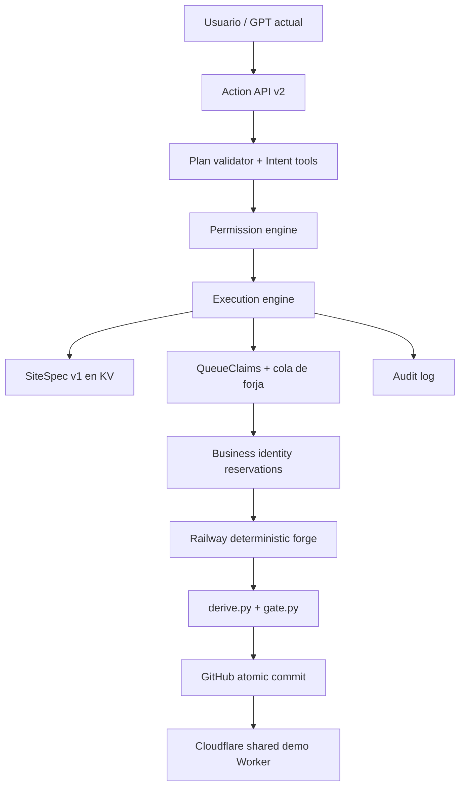

# Siteforge Control Plane

Esta fase mantiene una instalación de propietario único. No existe todavía una dimensión `tenant_id`.

El GPT no escribe HTML ni ejecuta Cloudflare directamente. Para modificar un sitio localiza el registro, cambia el `SiteSpec`, prueba la revisión y solicita publicación. La forja aplica el `contentPatch` al `content.json` existente y reutiliza el pipeline probado.

## Latencia de ejecución

`POST /api/agent/v2/execute` ejecuta y valida el plan antes de responder, pero persiste la
auditoría en segundo plano con `waitUntil`. Así la respuesta del GPT no queda bloqueada por
el segundo viaje al Durable Object que conserva el historial; los eventos siguen siendo
durables y `GET /api/agent/v2/audit` los expone cuando el usuario los necesita.

## Compatibilidad

Los endpoints `/api/agent/build`, `/api/agent/jobs/*` y `/api/agent/sites` se mantienen. El nuevo contrato vive en `/api/agent/v2/*`, por lo que el GPT actual puede seguir funcionando mientras se actualiza su Action.

## Persistencia actual

- `site-spec:<slug>:current`: revisión activa.
- `site-spec:<slug>:v:<revision>`: historial inmutable de revisiones.
- `control:audit:<id>` y `control:audit:index`: eventos de herramientas.
- `control:idempotency:<request_id>`: resultado durante 24 horas para evitar dobles operaciones.

KV es suficiente para esta fase de propietario único. La migración futura a D1/R2/Queues puede conservar estas mismas interfaces.

## Dedupe y SLA de construcción

`QueueClaims` conserva los claims activos y las reservas de identidad en SQLite. Cada
candidato genera claves por place id de Google Maps, teléfono normalizado, nombre+ciudad y
slug. Reservar, completar y liberar pasan por el mismo Durable Object; por eso cuatro
réplicas de Railway no pueden publicar dos veces el mismo negocio. El registro KV sigue
siendo la fuente visible para el panel y sirve para sembrar la deduplicación permanente de
los sitios históricos.

La forja dispone de 510 segundos. Reutiliza la URL exacta de Maps, consulta nichos genéricos
en pares, publica blobs de GitHub en paralelo y deja un margen de 90 segundos antes del SLA
de diez minutos. El reconciliador se ejecuta cada minuto y rescata cualquier ejecución a los
nueve minutos desde `started_at`, sin prolongar el SLA por heartbeats tardíos. El estado de un dominio pendiente también intenta finalizarse cuando
la UI consulta `/api/domain/status`, además del Cron de un minuto.
