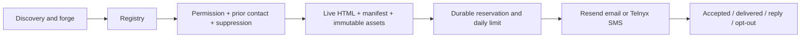

# Autonomous outreach pilot

## What runs in the cloud

The existing Cloudflare forge/discovery containers remain unchanged. The panel's
one-minute cron also invokes `OutreachCampaign` (`permission-pilot-v1`). This is a
separate coordinator for a bounded campaign, not a rebuild or a DO per website.
It sends at most one first-contact message per run and 20 attempts per UTC day.
No LLM call is needed to select an eligible recipient, check the demo or send it.

The owner's September 12 request authorizes this automatic pilot; older project
instructions about approving every individual batch no longer describe this mode.
Provider requirements and recipient opt-outs still apply.

## Eligibility and actual limitations

- Only a confirmed `has_own_site: false` business, explicit English/Spanish locale,
  exact first-party demo URL, and matching permission record is eligible.
- Google Maps contact information is **not** consent. Resend's current acceptable
  use policy prohibits cold/scraped email lists. Telnyx marketing SMS requires
  opt-in and applicable sender registration. No permissions were fabricated or
  imported from the scraped registry.
- Email is selected first when a matching email permission exists. Otherwise an
  SMS permission can select Telnyx. A send ledger blocks repeat contact across
  aliases/identities/channels. The initial pilot never automatically follows up.
- Existing contacted, declined and client CRM entries are excluded. A verified
  reply pauses further outreach. Delivery and replies do not count as a sale.
- Unknown provider results are retained for operator review, not retried after
  the provider's idempotency window. This favors no duplicates over blind retries.
- QA failures receive a one-hour cooldown so another eligible demo can proceed.
  Legacy demos without independent R2 manifests need independent publication
  before they become eligible; a successful HTML fetch alone is insufficient.
- Email replies are not connected yet. Delivery status is polled for seven days.
  SMS replies/STOP can be received through signed Telnyx webhooks once configured.
  WhatsApp and automated calls are **not implemented** by merely having Telnyx.
- There is no claim of an acquired client or successful live SMS in this change.

## Authenticated API

All `/api/outreach/*` endpoints use the existing `x-sf-key` panel authentication,
not the public registry API or GPT tool key. Consent cannot be granted by a public
upsert or instructions found on a business website.

| Endpoint | Purpose |
| --- | --- |
| GET `/api/outreach/status` | Configuration, provider readiness, blocked reasons, actual ledger counters |
| GET `/api/outreach/inbox` | Latest 50 conversations; optional `thread` hash returns latest 50 messages |
| POST `/api/outreach/read` | Mark the observed `threadId` / `eventId` read, without dismissing newer replies |
| POST `/api/outreach/config` | `{ "enabled": true, "dailyLimit": 20 }`; hard maximum 20 |
| POST `/api/outreach/consent` | Owner-attested evidence of a real request or double opt-in |
| POST `/api/outreach/run` | Run one candidate; optional `slug`, same guards as cron |
| POST `/api/outreach/event` | Record a verified reply, decline, opt-out or actual client outcome |

Consent input: `slug`, `channel` (`email` or `sms`), `email` or E.164 `phone`,
`source` (`inbound_request` or `double_opt_in`), `evidence` (12–1000 characters,
e.g. mailbox message reference and date), `confirmed: true`. This is an audited
operator assertion, not an automated check of the source. Never insert a record
without actually reviewing the evidence.

Event input: `email` or `phone`, `type` (`replied`, `declined`, `unsubscribed`,
`client`), `evidence`, `confirmed: true`. A sale requires an actual confirmed
commercial outcome; an opened link or positive reply is not enough.

The legacy `/api/send` now shares the same coordinator rather than bypassing
permission, QA and deduplication. The pilot sends its versioned English/Spanish
template, signed **Michael**, from **jose@merktop.com**. Manual DM drafts remain
editable. The panel exposes pilot status and pause/resume.

SMS conversations now retain individual inbound messages atomically with the
deduplication marker and suppression record. Repeated webhook deliveries cannot
erase history or turn old messages into new replies. An older message arriving
late is kept in history but does not replace the latest conversation summary.
All text is untrusted and is rendered as text, not HTML or agent instructions.

While the pilot is enabled, its cron sends at most one transactional owner alert
per known business conversation to `jose@merktop.com`, at most 20 alerts per UTC
day. Unknown senders and STOP messages do not generate email alerts. The alert
contains only a panel link, not the private phone number or message text. Its
durable reservation prevents duplicate alerts after provider timeouts/restarts.
These alerts are not pitches to prospects and do not change a business to client.
Inbox replies are still not automatically answered and are not proof of a sale.

Unsubscribe links are random capability tokens. GET is read-only; POST persists
suppression. No authentication cookie or secret appears in message links.

## Telnyx setup (must be verified before activation)

Store `TELNYX_API_KEY` in Cloudflare Worker secrets, never source code, browser
bundles, screenshots or logs. Also configure `TELNYX_FROM_NUMBER` (E.164),
`TELNYX_MESSAGING_PROFILE_ID`, and `TELNYX_PUBLIC_KEY` (base64 Ed25519 public key).
Only set `TELNYX_SMS_APPROVED=true` after checking the actual number, messaging
profile, applicable 10DLC/toll-free registration and its permitted use case.
These values can all be managed as Worker secrets to survive deploys.

Configure the chosen Telnyx messaging profile's inbound webhook to:
`https://siteforge-panel.odd-forest-9504.workers.dev/webhooks/telnyx`
Do not overwrite another application's profile; reuse a dedicated Siteforge one.
Buying numbers, accepting paid registration or expanding key permissions needs
the applicable approval. An existing account alone is not proof of readiness.

Outbound uses `POST https://api.telnyx.com/v2/messages`. Webhook verification uses
Ed25519 over `timestamp|raw_body`, a five-minute freshness window, and checks the
profile/receiving number. Duplicate terminal receipts cannot downgrade delivery.
Early receipts are retained if they beat the send response. STOP and every reply
block further automatic first-contact messages; replies are not auto-classified
as clients. No automatic API retries after an ambiguous result are assumed.

## Verification and rollback

Run `node --test ui/outreach.test.mjs ui/outreach-runtime.test.mjs
ui/control-plane.test.mjs ui/social-channels.test.mjs` with dependencies installed.
Runtime tests use local workerd and never send to production providers.

Deploy the panel only after the Wrangler dry run passes. Verify unauthenticated
API/webhook rejection, live status/cron timestamps, and La Coolmena QA. A send
requires a separate real eligible recipient and configured provider.

To pause immediately, POST `/api/outreach/config` with `enabled: false` and the
current limit, or use the panel button. Keep the durable ledger on rollback.
Never delete it to retry a send; reconcile ambiguous provider IDs first. The v2
DO migration is additive and does not remove queue or website state.

## Next gates toward a real customer

1. Connect existing Telnyx credentials and verify number/profile/registration.
2. Connect the actual reply inbox for `jose@merktop.com`; the available Gmail
   connector currently belongs to another address.
3. Review existing warm inbound requests and record only supported permissions.
4. Validate a consented internal SMS and incoming STOP end to end before scaling.
5. Add reply-aware followups and qualified proposal handling; preserve the price
   and domain commitments the owner actually approves. Do not invent sales.

### Verified deployment (September 12, 2026, America/New_York)

- Commit `69a3d2d6` pushed to main and panel deployed; cron observed on production.
- 31 local tests passed, including workerd RPC and authentication boundaries.
- La Coolmena live QA: HTML 200, manifest 200, 12 immutable assets 200.
- Telnyx credential validated and stored as a Worker secret. The account's one
  active number and `Merktop SMS` messaging profile were configured with the
  user-provided public verification key. The formerly empty profile webhook was
  set to this Worker's signed webhook route (PATCH returned 200).
- Production readiness reports key, number, profile and public key configured.
- Telnyx's brand listing returned **zero records** and the number's campaign
  lookup returned **404: Phone Number Campaign does not exist on account**.
  No registration was purchased or fabricated; approval flag remains unset.
- Production send ledger has zero accepted sends. No live outbound SMS, inbound
  SMS or client acquisition is claimed. The authenticated status endpoint reports
  blockers rather than claiming unattended sales are already working.
- The owner subsequently declined 10DLC registration. Do not buy or submit a
  registration without new authorization, and do not relabel automated marketing
  as personal/P2P traffic or remove the provider readiness gate to bypass it.
  Including STOP does not replace carrier registration or recipient consent.

References checked September 12, 2026:
- https://resend.com/legal/acceptable-use
- https://resend.com/docs/api-reference/emails/send-email
- https://developers.telnyx.com/api-reference/messages/send-a-message
- https://developers.telnyx.com/docs/messaging/messages/receiving-webhooks
- https://support.telnyx.com/en/articles/9940291-10dlc-campaign-compliance-requirements
